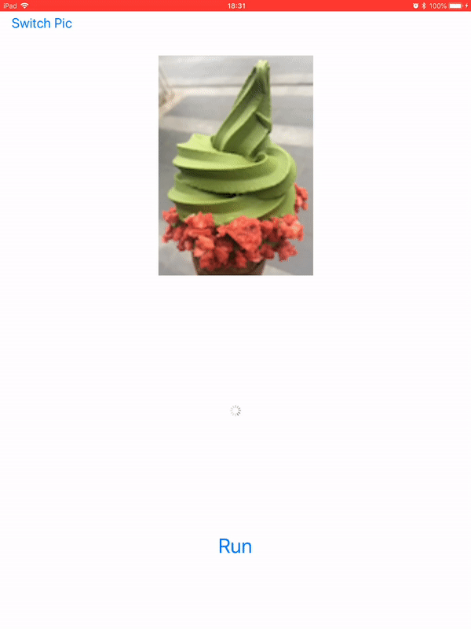
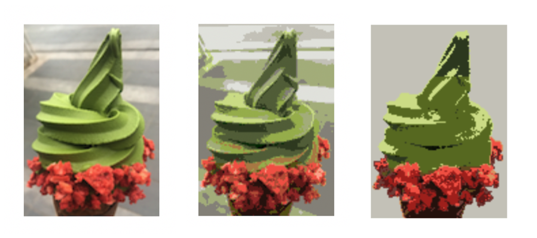
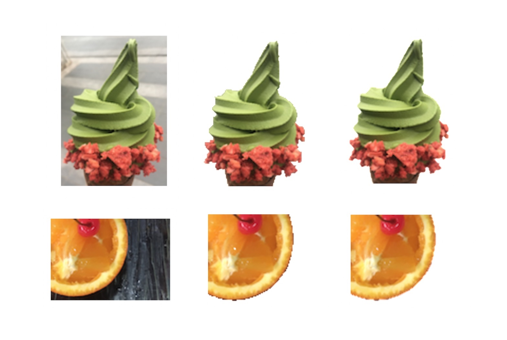

# Meanshift-based Image Segmentation

This is Assignment 2 of undergraduate course "Computer Vision". 

The task is to implement a non-deep(traditional) method to a computer vision problem.

## Implementation

- Meanshift clustering algorithm
- Simple UI & Asynchronization

- Optimizations

  - Kernel function comparison
  - Color space comparison

  

  Left to right: original, RGB, Luv.

  Segmentation on Luv space is generally better for Luv representation is more robust to lighting and shadow change.

   

  - Border matting

  

  Left to right: original, before matting, after matting.

## References

[Mean Shift: A Robust Approach Toward Feature Space Analysis](https://courses.csail.mit.edu/6.869/handouts/PAMIMeanshift.pdf)

[SwiftImageProcessing](https://github.com/skyfe79/SwiftImageProcessing)

[Metal](https://developer.apple.com/documentation/metal)